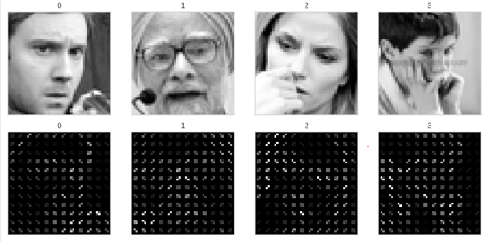
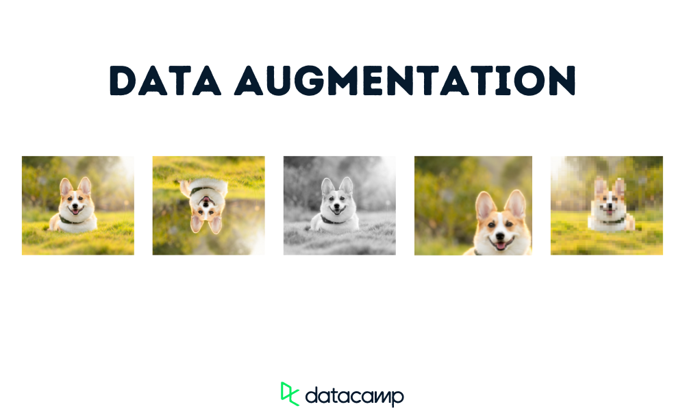

# Mini-Project for Fundamentals of Machine Learning Course

This repository contains the code and data for a mini-project on facial expression recognition using machine learning algorithms.

## 📑 Project Policy
- Team: group should consist of 3-4 students.

    |No.| Student Name    | Student ID |
    |:--------:|:--------:|:-------:|
    |1|Nguyễn Quang Trường |2110429|
    |2|Huỳnh Long Hải|21110286|

- The submission deadline is strict: **11:59 PM** on **June 22nd, 2024**. Commits pushed after this deadline will not be considered.

## 📦 Project Structure

The repository is organized into the following directories:

- **/data**: This directory contains the facial expression dataset. You'll need to download the dataset and place it here before running the notebooks. (Download link provided below)
- **/notebooks**: This directory contains the Jupyter notebook ```EDA.ipynb```. This notebook guides you through exploratory data analysis (EDA) and classification tasks.

## ⚙️ Usage

This project is designed to be completed in the following steps:

1. **Fork the Project**: Click on the ```Fork``` button on the top right corner of this repository, this will create a copy of the repository in your own GitHub account. Complete the table at the top by entering your team member names.

2. **Download the Dataset**: Download the facial expression dataset from the following [link](https://mega.nz/file/foM2wDaa#GPGyspdUB2WV-fATL-ZvYj3i4FqgbVKyct413gxg3rE) and place it in the **/data** directory:

3. **Complete the Tasks**: Open the ```notebooks/EDA.ipynb``` notebook in your Jupyter Notebook environment. The notebook is designed to guide you through various tasks, including:
    
    1. Prerequisite
    2. Principle Component Analysis
    3. Image Classification
    4. Evaluating Classification Performance 

    Make sure to run all the code cells in the ```EDA.ipynb``` notebook and ensure they produce output before committing and pushing your changes.

5. **Commit and Push Your Changes**: Once you've completed the tasks outlined in the notebook, commit your changes to your local repository and push them to your forked repository on GitHub.


Feel free to modify and extend the notebook to explore further aspects of the data and experiment with different algorithms. Good luck.

---------------------------------
<h1 align="center">Classification with FER2013 Dataset</h1>

<h5 align="center">
    
[](https://colab.research.google.com/github/hari-huynh/Fundamental-ML/blob/main/notebooks/EDA.ipynb)
</h5>


## I. FER13 Dataset
- **FER2013** (*Facial Expression Recognition 2013 Dataset*) introduced by Goodfellow et al. in Challenges in Representation Learning: A report on three machine learning contests
- **FER2013** contains approximately 30,000 facial RGB images of different expressions with size restricted to 48×48, and the main labels of it can be divided into 7 types: `0=Angry`, `1=Disgust`, `2=Fear`, `3=Happy`, `4=Sad`, `5=Surprise`, `6=Neutral`. The `Disgust` expression has the minimal number of images – 600, while other labels have nearly 5,000 samples each.


## II. Preprocess data
### 1. Eigenfaces (PCA)
> From Abstract of **Paper:** [Matthew Turk and Alex Pentland. Eigenfaces for recognition. Journal of cognitive neuroscience, 3(1):71–86, 1991.](https://direct.mit.edu/jocn/article/3/1/71/3025/Eigenfaces-for-Recognition)
> 
>  ...*faces are normally upright and thus may be described by a small set of 2-D characteristic views. The system functions by projecting face images onto a feature space that spans the significant variations among known face images. The significant features are known as "eigenfaces," because they are the eigenvectors (principal components) of the set of faces; they do not necessarily correspond to features such as eyes, ears, and noses...*

A facial image is a point from a high-dimensional image space and a lower-dimensional representation is found, where classification becomes easy. The lower-dimensional subspace is found with Principal Component Analysis, which identifies the axes with maximum variance.

The problem with the image representation we are given is its high dimensionality. Two-dimensional $p×q$ grayscale images span a $m=pq$-dimensional vector space, so an image with $100×100$ pixels lies in a $10,000$-dimensional image space already. 
We can only make a decision if there's any variance in data, so what we are looking for are the components that account for most of the information. The Principal Component Analysis (PCA) was independently proposed by Karl Pearson (1901) and Harold Hotelling (1933) to turn a set of possibly correlated variables into a smaller set of uncorrelated variables. The idea is, that a high-dimensional dataset is often described by correlated variables and therefore only a few meaningful dimensions account for most of the information. The PCA method finds the directions with the greatest variance in the data, called principal components.

**The process of reconstructing an image as the number of eigenfaces gradually increases (1 - 1000 eigenfaces/principal components)**

<p align="center">
  
  
  
  
  
  
  
</p>


### 2. Image Processing with HOG (Histogram of Oriented Gradient) & Image Generation 
#### 2.1 Feature Extractor with HOG
To diminish the
dimensionality curse and at the same time to attain high
recognition rate, there is dire need to select the most informative and relevant feature. 

Description of the shape of facial expression detection and local appearance are considerably described by HOG descriptors. A histogram of
gradient directions (edge orientations) of targeted image
is computed by dividing it into small connected regions
(cells) to implement these descriptors. The descriptor
is represented by combination of these histograms. The
algorithm is divided into multiple stages. Gradient values are computed as the first stage. Cell histograms are
created as second stage. Based on the values found in the
gradient computation for an orientation-based histogram
channel, each pixel within the cell casts a weighted vote.
The components of the normalized histograms are concatenated by the HOG descriptor as vector from all the
block regions. 

HOG features are comprised of gradients angles
and distribution of magnitude. Because of this fact, they
are naturally adaptable to variation in color and lighting
fluctuations. This fact witnesses their robustness in visual
data.

<p align="center">
  </br>
  <b>Hog features on random images</b>
</p>

#### 2.2 Data Augmentation to handle imbalance data


Keep the class data with the highest number of samples data, augment the data at different rates for minority classes


## III. Models
- We use following models:

| **Model**                    |   **Framework**    |         **Dataset**          |
|:-----------------------------|:------------------:|:----------------------------:|
| Logistic Regression          | NVIDIA RAPIDS cuML | PCA / Original data with HOG |
| Decision Tree                |      sklearn       | PCA / Original data with HOG |
| Random Forest                | NVIDIA RAPIDS cuML | PCA / Original data with HOG |
| Support Vector Machine (SVM) | NVIDIA RAPIDS cuML | PCA / Original data with HOG |
| Multi-layer Perceptron (MLP) |      sklearn       | PCA / Original data with HOG |
| XGBoost Classifier           |      XGBoost       | PCA / Original data with HOG |
| Vanilla CNN Model            |      Pytorch       |    Original data (Images)    |


##  cuML 


This project utilizes cuML for GPU-accelerated machine learning. cuML is part of RAPIDS AI, offering high-performance algorithms that speed up training and inference.

  -  🚀 Speed
cuML leverages GPUs to accelerate processing, significantly faster than CPUs, especially with large datasets.

 -  📊 High Performance
Ideal for large datasets due to GPU's parallel processing capabilities, reducing processing time and improving efficiency.

 - 🔧 Easy Integration
cuML's API is similar to scikit-learn, making it easy to transition and integrate into existing workflows.

 - 📚 Multiple Algorithms
Supports a wide range of algorithms: regression, classification, clustering, PCA, and more.

 - 🌐 Community & Documentation
Rich documentation and a large community provide ample support and learning resources.
[Document](https://docs.rapids.ai/api/cuml/stable/)

## IV. Hyperparameter Tuning
- Because `GridSearchCV` takes a long time to run, plus we have to specify exact model hyperparameters, this is inefficient. 
- We use `Optuna` to narrow the search for hyperparameters, facilitates better, faster and more efficient `GridSearch` with parameters.

So the hyperparameter tuning process goes through 2 steps
- **Step 1**: Bayes Search with Optuna to narrow search space
- **Step 2**. Grid Search find optimal parameters

### 1. Optuna


Optuna is an automatic hyperparameter optimization software framework, particularly designed for machine learning. It features an imperative, define-by-run style user API.  The code written with Optuna enjoys high modularity, and the user of Optuna can dynamically construct the search spaces for the hyperparameters.

### 2. Grid Search find optimal parameters.


Grid Search is a hyperparameter tuning technique used in machine learning to find the best combination of hyperparameters for a given model. Hyperparameters are variables that are not learned by the model, but rather set by the user before training.


## V. Results & Summary
### 1. With PCA dataset

| *Model*                    |  *Accuracy* | *Precision* |**Recall**|**F1**|
|:-----------------------------|:----------------------------:|:-:|:-:|:-:|
| Logistic Regression          |0.37|0.37 |     0.30     | 0.30|
| Decision Tree                |0.29|0.28 |     0.29  |    0.28 |
| Random Forest                |0.44| 0.62 |     0.38  |    0.42 |
| Support Vector Machine (SVM) |0.5|0.56  |    0.47   |   0.50 |
| Multi-layer Perceptron (MLP) |0.44|0.44   |   0.42  |    0.43 |
| XGBoost Classifier           |0.44| 0.54 |     0.38  |    0.40|


### 2. Original Dataset with HOG features 

| *Model*                    |  *Accuracy* | *Precision* |**Recall**|**F1**|
|:-----------------------------|:----------------------------:|:-:|:-:|:-:|
| Logistic Regression          |0.42| 0.36|      0.38  |    0.36|
| Decision Tree                |0.31|0.30  |    0.31   |   0.30|
| Random Forest                |0.48|0.57   |   0.43  |    0.45 |
| Support Vector Machine (SVM) |0.57|0.60    |  0.54   |   0.56|
| Multi-layer Perceptron (MLP) |0.48|0.48   |   0.48  |    0.48|
| XGBoost Classifier           |0.49| 0.52   |   0.42    |  0.43  |


## VI. Future Works
- Transfer Learning/ Finetuning with better models:
  - VGG, 
  - ResNet
  - ViT
  - ...

- Use algorithms / methods:
  - **Haar classifier** and **AdaBoost**. 
  - **LK optical flow** algorithm and **MRASM** methods 
  - **Geometric-based feature** method describes the shape and structure of face components such as eyebrows, eyes, nose, and mouth. 
  - The feature extraction algorithms such as **ASM** and **AAM** 
  - The **LBP**, **HOG**, **Gabor filter-based texture information**, local directional ternary pattern provide the appearance features were employed to detect the facial expressions.

In future, we can extend the work in developing an FER system to recognise different other facial or sign expressions rather than the basic expressions. For instance, *exhaustion, frustration, anticipation, aggressiveness* and so on helps in real-time applications. 
The present system uses available datasets that limit the efficiency when applied the same in real time. It is a known fact that the available facial expression datasets are not only frontal-view and also pre-processed under the controlled environment. 
Moreover, they have still image and image sequences are of fixed sizes, which enable the feature extraction process simple whereas in the real-time environment it's not possible. To cope with existing datasets and in a real-time environment, compatible new techniques should extensively develop from the baseline.
